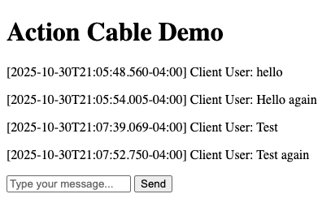

# action_cable_demo

This is a scratchpad application for me to learn to use ActionCable and Websockets effectively. It's just a simple playground that will be built up into a full chatroom app, converted to a React frontend, then merged into [Narratree](https://github.com/atshaw1994/Narratree).

### Screenshot

This screenshot was taken while using two seperate browser instances. The first was used to send messages 1, 2, and 3. The second was used to send message 4.

